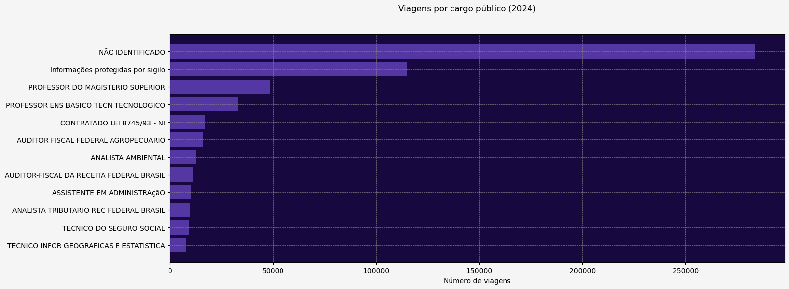
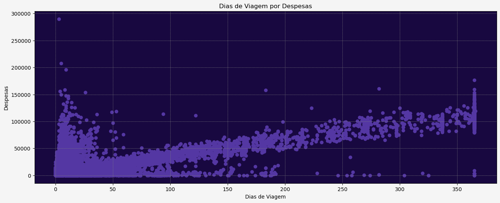

# Viagens Governo Federal - 2024

Projeto com finalidade de apresentar e analisar dados referentes a diárias e passagens de viagens governamentais a trabalho realizadas por servidores públicos do Poder Executivo Federal.

## Fonte dos dados

Portal da Transparência: [Acesse os dados aqui](https://portaldatransparencia.gov.br/download-de-dados/viagens).

### Instruções para Execução
1. Baixe os dados: Clique no link acima para baixar os arquivos necessários.
2. Organize os arquivos: Coloque os arquivos .csv dentro da pasta data do projeto.

Após isso, o script estará pronto para ser executado.

## Principais tecnologias usadas

## Destaques do projeto

### Número de viagens por cargo público
Gráfico que represente os cargos públicos que mais fizeram viagens, assim como a quantidade de viagens realizadas por cada um no ano de 2024.

---
### Quantidade de dias de viagens por despesas
Gráfico de dispersão que mostra que com o passar da duração em dias da viagem, o valor gasto por viagem também tende a aumentar, porém é possível ver alguns registros atípicos que com poucos dias de viagem já tem gastos bem acima do esperado.

